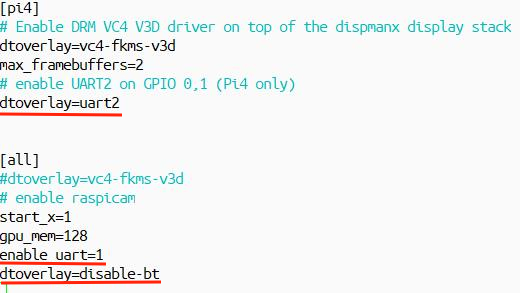
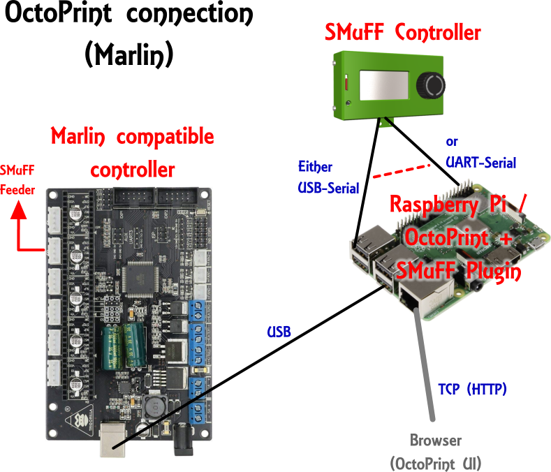
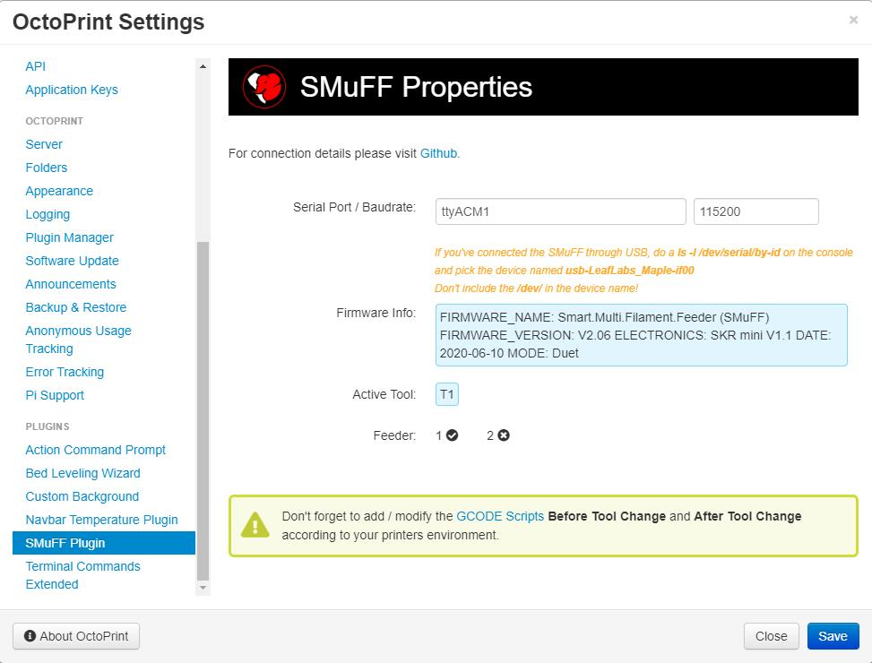
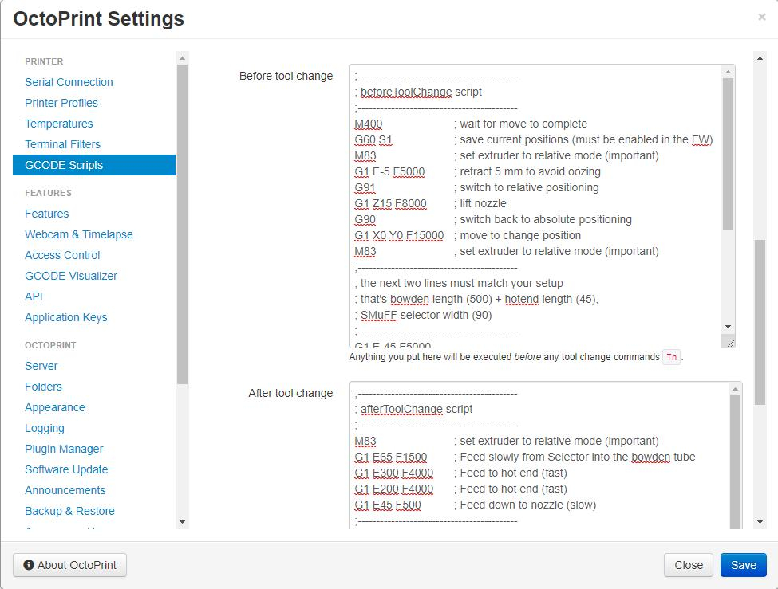
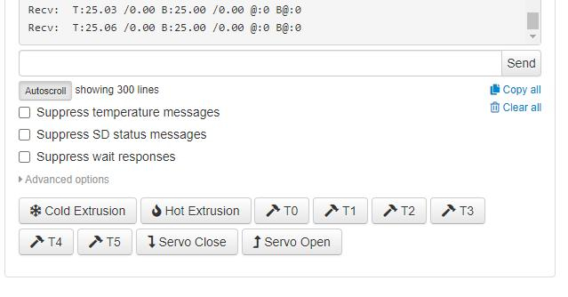
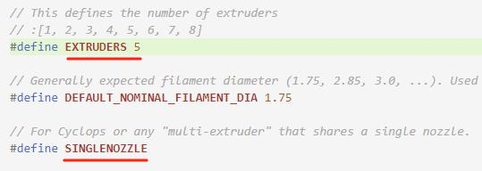
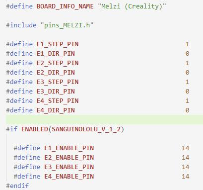

# OctoPrint-Smuff

This is a plugin for OctoPrint which handles tool changes for the SMuFF ([as published on Thingiverse](https://www.thingiverse.com/thing:3431438/)).
This plugin runs in the background and tracks tool changes (**Tx**) via the **octoprint.comm.protocol.gcode.queuing** and **octoprint.comm.protocol.gcode.send** hooks of OctoPrint.
When triggered, the plugin will send the according **Tx** command to the SMuFF via the Raspberry's second onboard UART **ttyS0** (RPI-3) or **ttyAMA1** (RPI-4).

## Setup

Install the plugin via the bundled [Plugin Manager](https://github.com/foosel/OctoPrint/wiki/Plugin:-Plugin-Manager) directly from the OctoPrint Repository or manually by using this URL:

    https://github.com/technik-gegg/OctoPrint-Smuff/archive/master.zip

From SMuFF firmware **2.06** on, you'll be able to connect the SMuFF directly via the onboard USB connector to your Raspberry Pi. This is not only the most convenient way but also seems the most reliable.
For further information on this topic, please have a look down at the "**Configuration**" section.

In order to make the plugin working as expected, you have to the following:

- Connect the Raspberry via USB **OR**
- Setup the UART mode on your Raspberry and connect the Raspberry to your SMuFF controller via 3-Wire serial interface (UART)

## Setting up your Raspberry Pi for UART connection

Open the **/boot/config.txt** file on your Raspberry Pi and add the following lines to it:

Save the configuration and reboot. After rebooting, make sure you'll see the **ttyS0** device (RPI-3) or the **ttyAMA1** device (RPI-4) in your **/dev** folder.

>**Notice:** *If you're having problems connecting the SMuFF to the Raspi 3, try removing the **dt-overlay=disable-bt** from the config.txt, reboot and try again*

For the physical serial connection get a 3-Wire cable and connect the pins **6 or 9 (GND)**, **8 (TX, aka GPIO14 aka UART0_TXD)** and **10 (RX aka GPIO15 aka UART0_RXD)** of the Raspi-3 extension connector to the serial interface of your SMuFF (on the SKR V1.1 mini that's the header named **TFT**).

*Image: Raspberry Pi expansion header*

For the Raspberry **Pi 4** I'd recommend using the 2nd UART from the PL011, since it's a "real" UART. The TX and RX signals for this UART can be found at the pins **27 (TX, aka GPIO0 aka UART2_TXD)** and **28 (RX,aka GPIO1 aka UART2_RXD)**. Those pins are not being used on the Pi 3. The **GND** is available on pin **30**.

Make sure that you have a cross-over connection for the TX and RX lines:

- GND goes to GND
- TX goes to RX
- and RX goes to TX

>**Notice**: *You don't have to wire any of the power pins (+5V or +3.3V), since both, the Raspberry and the SMuFF, are supposed to be powered on their own.*

Also, make sure that you have your SMuFF configured at the same baudrate you'll be using in the plugin (**115200 baud** recommended).

## Interfacing

Here's a picture how all the stuff comes together:

The main difference to point out would be, that your printers extuder stepper driver (E0/E1) is not connected to your extruder anymore but instead to the Feeder of the SMuFF directly.
OctoPrint is controlling your printer and feeding it with the GCodes, while it's also controlling the SMuFF when a tool change is pending.
All necessary operations for a tool change (i.e. unloading current filament, loading new filament, purging etc.) need to be configured in the OctoPrint settings within the GCode-Scripts section **Before tool change** and **After tool change**.

## Configuration

There's not much configuration going on here, since the only relevant paramters are the baudrate and the serial port used to connect the Raspberry Pi to the SMuFF.
The baudrate has been preset to **115200 baud**, which ought to be fast enough.
To change either the baudrate or the port, key in the device name (without the '/dev/') and/or the baudrate and click "Save". Also, if you change the baudrate here, please make sure you've changed it in the SMuFF accordingly.

Within the **Settings** dialog for the plugin, you'll be provided with some additional information i.e. whether or not the plugin was able to connect to the SMuFF. If the connection was sucessful, you'll see the firmware information coming directly from the SMuFF. You'll also see the currently active tool and the status of the Feeder endstops (up to 2 possible, usually only one is being used).
If you don't see this information here, you'll need to check either your settings or your physical connection.

**Please notice:** The plugin will preset the serial interface device differently, depending on the Raspberry Pi model you use. It's **ttyS0** on the Raspi 3 and **ttyAMA1** on the Raspi 4, both are direct UART connections on the GIO header mentioned above.

If you're connected through the USB connector, you need to figure out the according device. Therefore, open a console (SSH connection) to your Raspberry Pi after you've connected the SMuFF and enter the command:
>ls -l /dev/serial/by-id

The Raspbery will show you a list of devices, amongst them a device called **usb-LeafLabs_Maple_ifxx**. It also shows the **/dev/tty** device it is linked to. Usually the device is something like *ttyACM0* or *ttyACM1* on the Raspi3, *ttyUSB1* on the Raspi 4.
Take the device name after the **/dev/** and enter this into the SMuFF plugin *Serial Port* setting.

## Navbar indicator

This plugin also comes with an indicator in the navbar of OctoPrint. It's showing you which tool is currently selected and whether or not filament has been loaded (meand: The Feeder endstop has triggered). 
It also shows you whether or not the connection has been established successfully. If the connection is OK, the indicator will turn green, otherwise it'll stay gray.
Please notice that the navbar indicator is being updated frequently (approx. every 2 seconds).

## Additional setup

The main configuration for tool changes is happening in the **OctoPrint GCODE Scripts section**.
You have to apply the GCodes which will be executed **before** and **after** a tool change triggers. 
Within these scripts you're able to configure all the movements and retractions/feeds needed for a successful filament swapping.

The picture below shows you a sample of such scripts. Please be aware that you always have to modify these scripts to accomodate your printers setup, i.e. bowden tube length, speeds and such.

Here are the sample scripts in detail. Simply copy and paste these into your OctoPrint GCodes sections.

>   ;-------------------------------------------
    ; beforeToolChange script
    ;-------------------------------------------
    M400				; wait for move to complete
    G60 S1				; save current positions (must be enabled in the FW)
    M83				; set extruder to relative mode (important)
    G1 E-5 F5000			; retract 5 mm to avoid oozing
    ;-------------------------------------------
    ; Raising the Z-Axis may cause offset issues when it
    ; goes back due to backlash on the Z-Axis. If this 
    ; happens to you, delete the G91 - G1 - G90 lines
    ;-------------------------------------------
    G91				; switch to relative positioning
    G1 Z15 F8000			; lift nozzle
    G90				; switch back to absolute positioning
    G1 X0 Y0 F15000			; move to change position
    M83				; set extruder to relative mode (important)
    ;-------------------------------------------
    ; Next up is the (slightly modified) Marlin 2.0 
    ; MMU Ramming Sequence which I've shamlessly nicked 
    ; from the Marlin 2.0 firmware.
    ;
    ; I don't know who wrote this sequence but hats off to
    ; you Sir, for your enourmus effort and patience composing
    ; this sequence.
    ;
    ; This sequence proofed to shape the tip nearly perfect 
    ; before the filament gets retracted finally.
    ; This is an important step, because it definitely reduces
    ; the filament bulging and therefore reduces potenitial jams
    ; when swapping filaments!
    ; 
    ; So, don't discard these lines. If the filament tip doesn't
    ; seem shaped well enough for you, try playing with the
    ; nozzle temperatures before you mess with the sequence.
    ; Just a few degrees (5-10) up or down can make a huge
    ; difference.
    ;
    ; This sequence retracts 77 mm in total - take this into account
    ; for the rest that needs to be retracted. For example the E3D V6 
    ; hotend has round about 61 mm (75-80 with fitting), whereas
    ; the PTFE tube goes about 33 mm into the hotend, using a all metal
    ; heat break.
    ;-------------------------------------------
    G1 E1 F1000
    G1 E1 F1500
    G1 E2 F2000
    G1 E1.5 F2500
    G1 E2.5 F3000
    G1 E-15 F4000
    G1 E-14 F1200
    G1 E-6  F600
    G1 E10  F700
    G1 E-10 F400
    G1 E-50 F2000
    ;-------------------------------------------
    ; the next retracts must match your setup
    ; that's bowden length + hotend length + 
    ; SMuFF selector width (90)
    ;-------------------------------------------
    G1 E-485 F4000	; Retract filament according to your bowden length
    G4 S2			; wait 2 seconds (just for you to see where it ends)
    G1 E-90 F1200	; Retract from selector (slowly)
    M400		; wait for move to complete
    ;-------------------------------------------
    ; the next line is important and must not be removed!
    ;-------------------------------------------
    @SMuFF LOAD

    
>    ;-------------------------------------------
    ; afterToolChange script
    ;-------------------------------------------
    M83		; set extruder to relative mode (important)
    G1 E65 F1500	; Feed slowly from Selector into the bowden tube
    G1 E300 F4000	; Feed to hot end (fast)
    G1 E200 F4000	; Feed to hot end (fast)
    G1 E45 F500	; Feed down to nozzle (slow)
    ;-------------------------------------------
    ; use the next line only if you're not 
    ; printing with a purge tower!
    ;-------------------------------------------
    ;G1 E80 F240	; Purge out old filament (adopt the E value to your needs)
    M400			; wait for move to finish
    G61 S1 XYZ F3600	; restore saved positions (must be enabled in the FW)

The values for feed and retraction here apply to a bowden tube length of about 520 mm, which is feasible for the Ender 3, whereas the SmuFF was mounted on the top bar. The 45 mm for the hotend reflect the Ender 3s stock hotend. Remember that you have to adopt these values according to your printer setup. You can adjust those settings with the following step.

## Testing your GCode scripts

The easiest way to test out your GCode scripts is allowing the printer doing cold extrusions (**M302 S0**) and by initiating tool changes by sending **Tx** commands from the OctoPrint Terminal.

I did it by utilizing the [Teminal Commands Extend plugin](https://github.com/jneilliii/OctoPrint-TerminalCommandsExtended) from author *jneilliii*.

As you may have spotted in the picture, there are some convenience commands such as Servo open/close. The (pseudo) GCode for this is *@SMuFF SERVOCLOSE* for closing and *@SMuFF SERVOOPEN* for opening the servo.

>**Important:** Remove the bowden tube from the hotend before you do this.

If your scripts are set up correctly, the tool changing will end up with filament sticking out at the end of the bowden tube. The length of the filament sticking out is supposed to be the length of your hotend (more or less the distance from inlet/fitting to nozzle).

## Marlin setup (IMPORTANT!)

In order to make SMuFF and plugin play well together with Marlin, you have to modify some settings in your firmware, recompile and flash it to your printer.
>If you haven't updated your firmware to **Marlin 2.0.x** yet, this might be the right moment to do this.

First of all, you need to tell your Marlin it's a multi extruder setup by defining the number of tools used:

Also important: Remove the comments in front of the **SINGLENOZZLE** definition.

Event though OctoPrint controls tool changes via the SMuFF and the printer won't receive any **T*x*** GCodes, it'll send the initial temperature settings for each "Extruder". Those usually come from your slicers GCode. If the Printer isn't configured for multi material, this will lead to error messages and OctoPrint will reset the current tool to **T0** - which will eventually lead to selecting the wrong tool.

Next, you have to set up fake steppers to satisfy the Marlin sanity check. Do so by duplicating the **E*x*_STEP_PIN**, **E*x*_DIR_PIN** and **E*x*_ENABLE_PIN** in your printers *Configuration.h* or your printers *Pins.h* for each extruder defined in the first step and set them all to the same pin numbers as for **E0_*xxx*_PIN**:

Next, comment out **PREVENT_LENGTHY_EXTRUDE**. Otherwise this will lead to problems while trying to swap the filament:

You may leave it in there and redefine the **EXTRUDE_MAXLENGTH**, as I've tried to, but it didn't work out for negative extrusions (a.k.a retractions). The Marlin firmware still reported an error.

Finally, enable the option to store/restore positions by the **G60/G61** GCodes, since this feature is being used in the after-/beforeToolChange scripts:

Because the SMuFF became your main extruder now, you also have to adjust the **E-Steps** for your printer.
The most convenient way doing this is by setting it up using the **M92** GCode in the terminal window.

Since the SMuFF has a geared drive with a gear ratio of 3:1, the E-Steps sould be in the range of 402-405. Set it to **M92 E402** initialy and calibrate the exact value afterwards by utilizing the well known calibarion procedure.
Don't forget to store the new setting with **M500** each time you change this value.

>***Notice***: You can do this configuration directly in the Marlin firmware as well (look out for **DEFAULT_AXIS_STEPS_PER_UNIT**), though, I wouldn't reccomend doing so before you've calibrated the exact E-Steps for your printer.

## Slicing multi material models

To set up a test print, you need to slice a multi material model first and then upload it to OctoPrint.
>**Please notice:** This plugin won't work, if you copy the sliced model directly onto your printers SD-Card. You have to use the OctoPrints internal storage for this.

To be able to slice multi material models you need to set up you slicer accordingly. There is a fantastic video on this topic from [Michael (a.k.a.Teaching Tech)](https://www.youtube.com/channel/UCbgBDBrwsikmtoLqtpc59Bw) which covers all the known slicers [here](https://www.youtube.com/watch?v=xRtvbICRh1w).

Allthough Michael is referring to dual extrusion, the process is still the same for more than two materials.
One important point is that you have configured all tools (i.e. feedrate, temperatures, etc.) according to your printer, before you move on setting up the different processes for each individual material (color).
